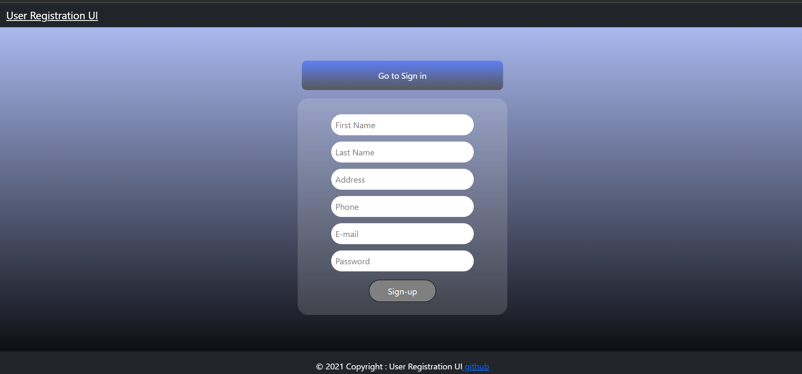
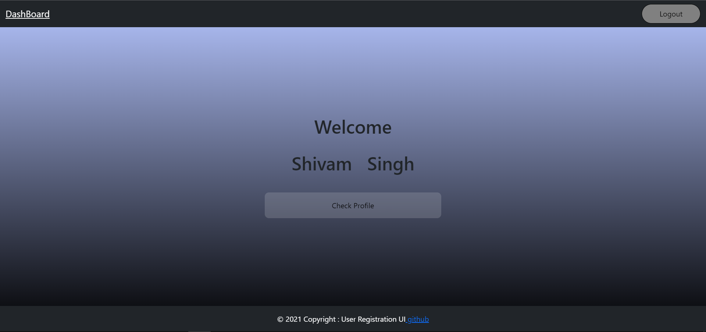
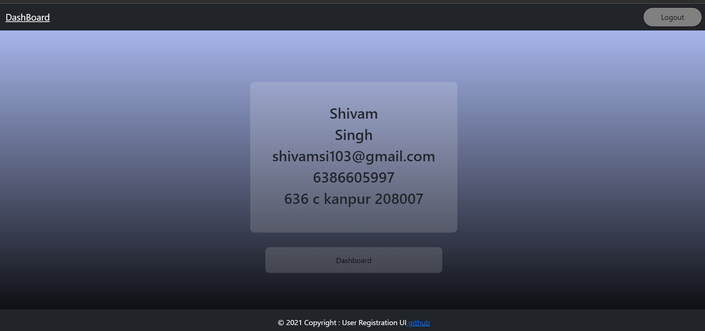

# User-Registration
One must initially set the database connection url in "backend/src/DB/mongoose.js" to Connect to the database in system of yours

<h3>Login page</h3>

<h3>Registration Page page</h3>

<h3>User Welcome Screen</h3>

<h3>User Profile Page</h3>

